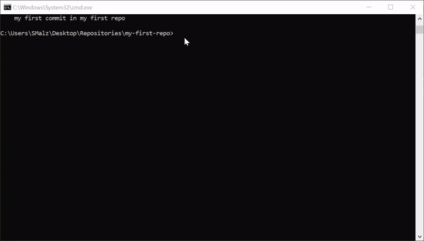

# Git and Github tutorial

What is Git, what's the difference to Github and Gitlab why does this have to be so confusing?? Don't worry, this will help. This guide is supposed to give you the basics about working with Git and Github. But wait, why **Github** and not **Gitlab**? There are two reasons for that. On the one hand Github and Gitlab are almost the same when it comes to their usage. This means, if you are familiar with Github you will also be familiar with Gitlab! On the other hand, the Gitlab we use in our institute is an installation inside of the institute, and there occur many issues concerning the registration of new users, which are basically solved in the first week but can cause confusion. Therefore we start here with **Github!** 

## Disclaimer:
In this tutorial, we will at first get startet, which means that you will get your hands dirty before you will understand what is happening in detail. This is nessecary because it is very easy to understand Git and Github when it has been already used. If you try to understand it without previuously having used it before, it will be very confusing and abstract! It's a little bit like the hen and egg padardox. 

**Furthermore!** This tutorial is not meant as read only. I designed this tutorial in a way that you will have to follow the steps and get used with the wording and the basic commands. Git and Github can be learned very fast! But you will need to work on it get used to it and get a feeling of how it works. Therefore, please perform the steps described in the tutorial :)

# Tutorial Steps
- [install git](#install_git)
- [Create Github Account and clone repository](#create-gihub-account)
- [synchronise with Github](#github-push-pull)
- [final thoughts](#final_thoughts)

---


<a class="anchor" id="install_git"></a>

# Installing Git

Git in contrast to Github or Gitlab is a program which runs on your computer. Therefore:

### Step 1 Visit Git website and download the installer:

- [https://git-scm.com/download/win](https://git-scm.com/download/win) **for windows users** (**64 bit installation)**
- [https://git-scm.com/download/mac](https://git-scm.com/download/mac) **for mac** (if you are using mac then it is probalbly already installed)

### Step 2: First use of Git

Now it is installed but wait there is no programm I can open?! - **Yes that's right - dont Worry**

#### Check if Git was installed successfully:

open your command line (cmd) and enter the following command:

`git`


Then press enter, and you should get the following output:

<details> <Summary>Output</Summary>

```
C:\Users\Malzacher\Desktop\repos>git
usage: git [--version] [--help] [-C <path>] [-c <name>=<value>]
           [--exec-path[=<path>]] [--html-path] [--man-path] [--info-path]
           [-p | --paginate | -P | --no-pager] [--no-replace-objects] [--bare]
           [--git-dir=<path>] [--work-tree=<path>] [--namespace=<name>]
           <command> [<args>]

These are common Git commands used in various situations:

start a working area (see also: git help tutorial)
   clone     Clone a repository into a new directory
   init      Create an empty Git repository or reinitialize an existing one

work on the current change (see also: git help everyday)
   add       Add file contents to the index
   mv        Move or rename a file, a directory, or a symlink
   restore   Restore working tree files
   rm        Remove files from the working tree and from the index

examine the history and state (see also: git help revisions)
   bisect    Use binary search to find the commit that introduced a bug
   diff      Show changes between commits, commit and working tree, etc
   grep      Print lines matching a pattern
   log       Show commit logs
   show      Show various types of objects
   status    Show the working tree status

grow, mark and tweak your common history
   branch    List, create, or delete branches
   commit    Record changes to the repository
   merge     Join two or more development histories together
   rebase    Reapply commits on top of another base tip
   reset     Reset current HEAD to the specified state
   switch    Switch branches
   tag       Create, list, delete or verify a tag object signed with GPG

collaborate (see also: git help workflows)
   fetch     Download objects and refs from another repository
   pull      Fetch from and integrate with another repository or a local branch
   push      Update remote refs along with associated objects

'git help -a' and 'git help -g' list available subcommands and some
concept guides. See 'git help <command>' or 'git help <concept>'
to read about a specific subcommand or concept.
See 'git help git' for an overview of the system.

```

</details>

if you see this long text, everything is fine :). Git is installed and we are good to go :) 

---

<a class="anchor" id="create-gihub-account"></a>

# Workflows in Git and Gitub

Now we have set up git locally, but the use the full power we need, we will have to connect it to a Github repository, therefore we need to perform some last configurations before we can crazy:

- **Step 1:** Create a github account
- **Step 2:** Create a new Repository on Github
- **Step 3:** Connect Github with your Computer


<Details><Summary> Workflow </Summary>


</Details>

## Step 1 Register on Github

- Visit: [https://github.com/](https://github.com/)

and Create an account for a tutorial, please click [here](https://fz-juelich.sciebo.de/s/vZwAO3FKJVl8Ex6)

## Step 2: create a new repository on Github

Now we have installed git locally and we have our Github account, so now we are good to go and start working:

The first step will be to create a repository on github. Repositories can be seen as **storage units** for files. It is important to start like this, because we want to be able to share with other, work with our supervisors or work on different computers and have everything synchronised! In the First step, Therefore Create a new Repo as suggested in the gif or the video:


a full video tutorial is available [here](https://fz-juelich.sciebo.de/s/6fB2heVQsfNBBaw)


## Step 3: Connect Github with your local git

This is a really amazing function of github. To connect your local repository with your Github repository you can simply **clone it**:

**Step 3.1 Open your Github repository and copy the url of your repository:**


**Disclaimer!** 

- Make sure that the created method is **https**
- Copy the url shown in the field

**Step 3.2 Clone your repository:**

Cloning means that you will create a copy of a repository you have created on github. The only thing you will have to do to realise this is to open your shell and clone the repo with the following command:

`git clone <repostory-url>`

Example:


**Gif how to clone a Repo:**

<details> <Summary> Gif of cloning the repo</Summary>


</details>

**Video tutorial of how to clone a repo, more comprehensive and with tips:**

See Video [here](https://fz-juelich.sciebo.de/s/G849OFzUkjzMbAt)

**!Important** Now we basically have two repositories, one on your computer, and one on your Github account! 

---

<a class="anchor" id="workflow"></a>

# Git Workflow

Now we have a **Github account**, **git** installed on your computer and a new **repository created on Github**, which is also **cloned (copied)** to your computer. Now lets get started

## Change the Content of the local Repository

### Task 1 (optional) Create a new python file and add it to your local repository

In my case, I will create a plain and simple python file, called **hello_world.py** with the following content:

```
print("Hello World")

```

### Task 2: Create a new word file

If you are not a programmer, no problem in this case, please create a new word file. What the content is doens't matter

In the end your local repo should look like this:


## Stage and commit the changes

Once we have our new files, how do we tell git what has changed and why does this not happen automatically?

One thing is important, git was created as a very intellingent and forward-looking concept. Therefore it does not simply track all the changes which have happened, you will have to tell git which files to track. But! Don't worry it is really easy:

### Step 1: Git status

the command `git status` is one of your best friends. It shows you what is going on in your repository. In particular, it shows you which files are altered, new added or deleted (if something was altered, the file will be red):


### Step 2 Git add 

the `git add` will tell git, which files are supposed to be versioned. This is important since you don't always want to stage every file. In our case we will use `git add .` this command will select every file in this repository to be versioned. 


As you can see in the picture, after the `git add .` we also ran the `git status` command again. Now all the files we have selected to be versioned will appear in green. In the language of git we **staged** the files. The **"staging zone"** is basically an intermediate between the versioned and the unversioned files. Now the files are ready to be versioned

<details><Summary>Gif of the add process</Summary>


</details>

### Step 3 Git commit

with the command `git commit` the actual version is created! The commit command looks like this:

`git commit -m "my first commit on my first repository"`

This is now something special, because we have suddenly the **-m** and the sentence (`"my first commit on my first repository"`):

- **m:** This means message. Every commit (versioning process) is supplemented by a comment. This is important, since you will not have one versione but many! And how do you want to keep track of the changes that happened in every version? Answer: the commit message, wich is added as sentence behind the -m


<details><Summary>Gif of the whole process</Summary>

This gif shows again the whole process of staging (git add) and committing (versioning) again


</details>

Now we have created a new Version! All your previous changes are saved and can be retrieved again!


You can take a look at all your versions (commits) git the commad `git log`:


<details><Summary>How do I retrieve older versions</Summary>

The recovery of an older version is used very rarely in comarison to the other commands and will probably confuse in the beginning. Therefore, we will skip this in this tutorial. If you will have to restore an older version [here](https://www.youtube.com/watch?v=UmE0uf5UMzA) you will find a tutorial which shows you how to do this in detail!

</details>

---
<a class="anchor" id="github-push-pull"></a>

# Synchronise your local repo with the Github repo

## Add your changes to the Github repository

Now we have our version created on our computer with git. but wait what about the Gitlab repository we have created in the beginning [(see here)](#create-gihub-account)? How do we get the changes to there? This is luckily very easy. We only need one command and one special adjustment!:

the command is `git push -o -m`




Now if we take a closer look to the Github repository, we will see this:


Our changes are commited (or we have created a version) and we have our files on our local computer and our Github repository. With the Github repository, we can share our work with supervisors, colleagues or friends! This brings us already to the last question: What happens if someone (for example my supervisor) add changes on my repo? 

## Retieve changes from the Github repository

In this example someone added a new file to the Github repo. 


In this case we of course also want to have this file on our local system. Therfore, we can use the `git pull` command:


---

<a class="anchor" id="final_thoughts"></a>
# Final thoughts

This tutorial was very detailed and intended to give you the most important basics of the work with Git and Github and show you very low level how to work with the command line. In the beginning it may seem overwhelming, but once you get familiar with the wording (staging, commiting etc.) everything will be much easier. Furthermore, the usual workflow with Git and Github is:

- **Pull:**
get changes made on your Github repository by your supervisors or other colleagues

- **Work on files:**
Work on your files, add everything needed and improve your project

- **Stage your changes:**
use the `git add` command to selected the files to be commited (versioned)

- **Commit your changes (create version)**
use the `git commit` command to commit your changes (create a new version)

- **Synchonise your changes with the Github repo:**
use the `git push`command to synchronise your changes with the github repo. Now your supervisor or colleagues can again review your changes!

<details><Summary> Workflow chart </Summary>


</details>

The take home messages from this tutorial are:

- How to create a [Github repository](#create-gihub-account)
- Cloning Repositories [from Github](#create-gihub-account)
- The meaning of staging (add command), versioning [(commit command)](#workflow)  
- push (add your lates changes to your Github repository) and pull [(retrieve changes from Github)](#github-push-pull)


There are many more applications for git and Github. My intention in this tutorial was basically to give you the most basic concepts and how to get started with git and Github. It looks really intimidating in the beginning but once you know how to handle the wording and the basic commands it's very easy and productive. Furthermore, you will probably use Software like VSCode or Github desktop, which provide an user interface. But this is very dependent on how your work will continue. Github reveals its power especially when collaborating with other colleagues. In Github, you will find a whole project management platform, which will help you to organise your work. A tutorial for this can be found [here](https://www.youtube.com/watch?v=TKJ4RdhyB5Y&list=PLB5jA40tNf3v1wdyYfxQXgdjPgQvP7Xzg&index=5)


