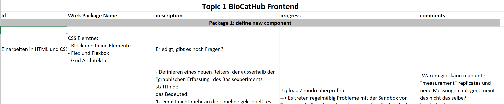
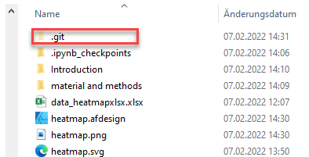
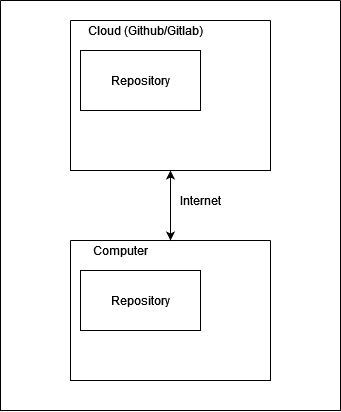

# GIthub/Gitlab: Living in Repositories

# My Motivation

 
How did I get started with repositories

How do you structure your daily work life? How do you organise your tasks and projects? Most anwsers (including my own) was that I have at best an Excel sheet where my tasks and projects are organised in. And to be honest, this already was a major improvement. One benefit was that I suddenly could see the progress (or like in science not progress) I made in my work. The next benefit was that the way I give feedback to students working for me has improved: When you have a simple table consistent of three columns in which your unstarted, in progress and finished tasks are listed, your supervisor will have one view the possibility to see if everything is running as planned, or if some restructurations have to be made. 

---

## My entrance in repositories

As decribed above, this gave me a lot of new possibilities in planning and reporting to colleagues and supervisors. Nevertheless, there were problems left. The first one was: How do I store my files and documents. Cloud servers like **dropbox** and **sciebo** really changed my life there. I now had the possibility to have files available on different devices. This works also very great, as long as your project doesn't grow over a certain size or too many people work on one document or need to work in the folder. Because once several people had to work in on one sciebo or dropbox folder, there were suddenly a lot of conflicts with several files, a lot of new versions occured and once a folder had reached a distinct size, it was hard to keep track of everything. Futhermore, I usually created a file structure only I did understand. Which means that if someone else had to search through my folders this was very challenging. In total it was a lot better with room left for improvement!

Then I started working with repositories and this suddenly gave me whole new view on folder structures and storage.
First of all what is a repository? It's basically a **bucket** in which your folder structure is stored. The only difference is that changes made in your repository are versioned. This happens with a small software called **git**. In this folder changes made in your repository are stored and can be used by the software **git** to restore your folder up to the first day of use!

This was already great, simply because I never had to worry about losing the progress of manuscript I created or data I collected. But now you still only have a versioned folder on your repository right?

Not directly. The great benefit of repositories is that you can synchronise them with storage capacities living in a cloud:

This means in principal that you have now a similar setup as with dropbox or sciebo. With the difference that everythin is versioned, right? Not directly. 

Together with these functionalities you will get:

- complete project management platform 
- a possibility to archive your repository once you're finished
- you can create example repositories other can retirieve very easily and learn from it or improve it
- Selected colleagues can always see/comment the progress of your work

This means that you now not only have the possibility to plan and organsie your work in a much more shareable and easier way, you can connect different tasks directly to files in your repository!

# First steps with git and Github

There's a tutorial [here](https://github.com/StephanM87/Git-and-Github-Start/tree/main/Git%20tutorial) which will show you how to get started.
