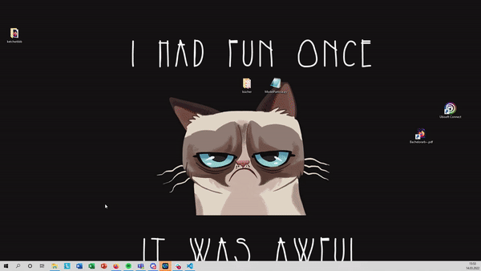

# Getting started with Git and Github in VS Code

When you have done the tutorial on [Git and Github](https://github.com/StephanM87/Git-and-Github-Start/tree/main/Git%20tutorial) you will have learned about the most basic commands and wording in git and Github. In particular:

- Clone
- Stage 
- Commit
- Push and pull

These will be the basics that will follow you the rest of your time while working with git. In the last tutorial we worked a lot in the command line. This will end already again! :)

The first thing we will need to do is to set up your working environment. Therefore please install the following two programs:

**But wait, what if I am not a Programmer?**

Then please use [Github desktop](https://desktop.github.com/) and follow this [tutorial](https://www.youtube.com/watch?v=RPagOAUx2SQ)

1. [Anaconda Navigator](https://www.anaconda.com/products/individual#windows)
2. [Virtual Studio code](https://code.visualstudio.com/)

(If you are in the institute you can also call the IT +49 2461 61-3949) and tell them to install Anaconda. The will know what to do with this information.

After installing, it should look like this on your computer:

What did I install

## Anaconda

Anaconda is the all inclusive package with everything you need to get started with python programming. You don't need to understand what's happening there in detail. Just now, there's everything included you need! 

## VS code

VS code is simply the best tool I know for writing code. You should always open it over the Anaconda Navigator, then you have the whole power of Anaconda in VS code

## How to get started with VS code

